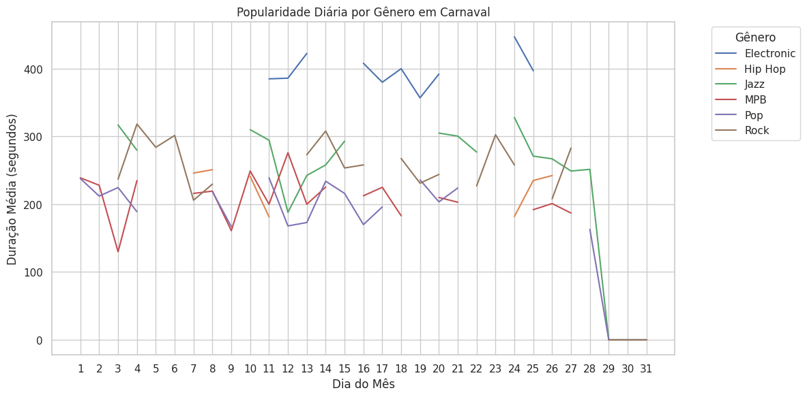

# 🎸 NexusSong  🎹 
###### 🎼 O futuro é a música!
## Introdução

Este projeto foi realizado com fins acadêmicos na matéria de prática e pesquisa do NES (Novo Ensino Suplementar).
Neste projeto, iremos analisar os dados encontrados em um arquivo csv que tratam dos dados de um streaming de música.

## Objetivos

Esta análise tem por objetivo identificar uma proposta de investimento promissora que gere lucros, através dos dados iremos verificar qual gênero musical e estilo mais popular atualmente.

### *Contexto de mercado*

O mercado de serviço de streaming de música é um dos mercados que mais crescem nos últimos anos, este mercado já disputa com o mercado de shows ao vivo por um lugar no consumo mundial de entretenimento. O mercado de streaming é extremamente promissor pois com a evolução tecnológica, o abandono do mundo físico e a substituição do mundo físico pelo mundo digital a tendência é de que os serviços de streaming tomem conta de todo o mercado e criem uma hegemonia forte.

### *Oportunidade*

Investir neste mercado ainda em ascensão é investir e garantir um espaço em um mercado que irá predominar nos próximos anos, um mercado que além de ter um custo reduzido em comparação ao mercado de shows ao vivo possui uma margem de lucro consideravelmente maior, visto que o acesso é maior.

O lançamento de músicas sempre foi algo custoso, lançar músicas diretamente em serviços de streaming possui baixo custo em comparação ao lançamento de mídias físicas, o alcance dessas músicas é maior, conquistar patrocinadores se torna mais acessível pela maior visibilidade, e portanto a margem de lucro tende a ser maior.

## Visão Geral

### *Possível investimento*

O lançamento de músicas diretamente para o streaming.

### *Potencial de mercado*

Alto potencial de mercado, pela alta visibilidade, baixo custo de investimento e lucros que chamam a atenção.

### *Investimento necessário*

A prióre o investimento necessário é apenas o custo de produção da faixa, a publicação na rede de streaming e a divulgação.

## Dados Encontrados e análises

### Distribuição de compartilhamentos por gênero musical.

Veja nos gráficos abaixo que `o estilo musical mais compartilhado é o Pop`, seguido pelo MPB e logo em seguida, o Rock. Isso demonstra que o público tem grande interesse em compartilhar músicas do gênero pop. os estilos MPB e Rock também possui consideráveis níveis de compartilhamento.

### Boxplot da distribuição de compartilhamentos por gênero.

Veja que `os estilos que apresentaram outliers de compartilhamentos foram o Rock, o MPB e o Hip-Hop`, sendo este terceiro menos presente.

### Dados de distribuição de músicas por gênero - gráfico de barras

Veja que nos gráficos a seguir, podemos verificar os gêneros musicais que mais predominam o top 10 de músicas mais ouvidas.

### Distribuição percentual de músicas por gênero

Gráfico percentual de distribuição dos gêneros musicais das músicas mais ouvidas. Veja que `o Rock predomina o ranking`. Estilos como MPB e Jazz são de se atentar.

### Média de duração de streams por gênero

Percebe-se que `a reprodução de músicas eletrônicas tem maior tendência de durarem mais do que as demais`. Seguida do Jazz e em sequência o Rock. Curioso notar que o Rock se faz presente ao mínimo no pódio das tabelas até agora.

### Identificação de outliers na duração de streams.

Após cuidadosa análise foi constatado que os `outliers em duração de streams se tratam de músicas do gênero eletrônico`, em sua totalidade. Com isso, podemos concluir que o público tem maior tendência a ouvir músicas eletrônicas completas e por maior tempo.

### Popularidade mensal por gênero (duração média dos streams)

Como comprovado pelo gráfico anterior, de maneira disparada `a música eletrônica predomina o tempo de uso` dos usuários. Não esqueçamos do Rock, que se faz presente no pódio.

### Popularidade diária por gênero no natal

A primeira vista, os gráficos a seguir podem parecer confusos, e de fato são. Veja que quando há descontinuidade em linhas é porque não houveram dados registrados neste determinado intervalo de tempo. `Veja que na véspera de natal, e no dia de natal o estilo mais consumido foi o Jazz` e em sequência o Rock, que por sua vez, este último disparou no aumento do consumo. Houve uma queda brusca no consumo de música eletrônica neste período.

### Popularidade diária por gênero no Ano Novo

`No dia de ano novo, o estilo musical mais consumido foi o Rock`. Durante o mês houve uma gigantesca variação, onde a única certeza é que durante o restante do mês de janeiro, desconsiderando o feriado, o estilo mais consumido foi a música eletrônica.

### Popularidade diária por gênero na Páscoa

De modo análogo, podemos notar que `no feriado da páscoa o estilo mais consumido foi o Rock`, de maneira acirrada e de certo modo, `um empate técnico entre Rock e MPB`.

### Popularidade diária por gênero no Halloween

`No dia 31 de outubro a música eletrônica predominou` os serviços de streaming de música, é importante ressaltar que não houveram dados dos demais estilos musicais neste dia, o que indica certa preferência do público por música eletrônica neste período.

### Popularidade diária por gênero no Carnaval

`Veja que no carnaval, houve um aumento significativo da busca pela MPB` e um declínio considerável na busca pelo Jazz. Ao término do dia 13, houve uma busca pelo Rock, o que indica que este estilo não é muito procurado nesta época. A música eletrônica se manteve no topo, porém apesar de seu crescimento de fato ocorrer, ele não foi tão expressivo quanto o crescimento da MPB.

### Horários de pico de reprodução

Observa-se que o `horário mais procurado pelos consumidores para ouvir música é as 22 horas`. Um horário geralmente associado ao sono, o que revela uma tendência dos usuários ouvirem música antes de dormir, ou até mesmo para dormir.

### Frequência de gêneros para a faixa etária menores de 18 anos

Perceba que `o público muito jovem tem tendência a ouvir estilos como Hip-Hop, Pop e Música eletrônica`, mas o Rock segue como uma quarta opção que de certo não é ignorada.

### Frequência de gêneros para a faixa etária 18-24 anos

Veja que neste caso, a frequência já se altera, neste `público jovem, o Pop e o Rock ocupam posições de destaque` dentre os gêneros mais consumidos.

### Frequência de gêneros para a faixa etária 25-34 anos

`Nesta faixa etária, o Rock assume a grande posição de destaque`, assumindo a liderança. Logo em sequência seguimos com o pop.

### Frequência de gêneros para a faixa etária 35-44 anos

Neste público mais adulto, surge a MPB como grande força, o rock perde um pouco de sua força, mas ainda ocupa posição de destaque. `É válido ressaltar como a MPB tem mais influência neste público mais velho`.

### Frequência de gêneros para a faixa etária 45-54 anos

Nesta faixa etária, `há uma disputa pela primeira colocação entre MPB e Jazz`, o Rock surge como uma terceira opção. Perceba que num público mais velho, o MPB éo estilo musical mais ouvido, e veja que isso irá se manter.

### Frequência de gêneros para a faixa etária 55+ anos

Veja que nossas previsões se mantiveram, a MPB é o estilo mais ouvido, com um empate técnico com o Jazz. O Jazz foi se tornando mais popular conforme a faixa etária aumentou, interessante notar que os gostos se diferem bastante com o passar da idade.

### Heatmap de correlação das variáveis de música

Este heatmap mostra as correlações entre variáveis relacionadas a músicas (`duration_seconds`, `liked`, `added_to_playlist` e `share_count`). A única correlação significativa é entre `liked` e `share_count` (0.53), indicando que músicas curtidas têm mais chance de serem compartilhadas. As demais variáveis apresentam correlações muito baixas, sugerindo que duração, curtidas, adição a playlists e compartilhamentos são, em grande parte, independentes entre si.

### Gráfico de dispersão: Duração de 0 a 50 segundos

Não foram encontrados dados de músicas de duração entre 0 a 50 segundos.

### Gráfico de dispersão: Duração de 50 a 100 segundos

Veja que há pouquíssimas músicas com duração de 50 a 100 segundos, e seu índice de compartilhamento é 0, conforme o gráfico abaixo.

### Gráfico de dispersão: Duração de 100 a 150 segundos

Veja que os índices de compartilhamento nesta duração, já melhoraram e contam com um outlier de compartilhamento do gênero Hip Hop. Mas ainda há poucas músicas neste intervalo de tempo.

### Gráfico de dispersão: Duração de 150 a 200 segundos

Neste intervalo, obtemos um índice de compartilhamento mediano, e possuímos várias músicas neste intervalo de tempo musical.

### Gráfico de dispersão: Duração de 200 a 250 segundos

Este é o ápice de compartilhamento e quantidade de músicas em nosso estudo. A maioria dos outliers de compartilhamento estão neste intervalo, sendo esta a duração mais recomendada em nossa análise.

### Gráfico de dispersão: Duração de 250 a 300 segundos

### Gráfico de dispersão: Duração de 300 a 350 segundos

### Gráfico de dispersão: Duração de 350 a 400 segundos

### Gráfico de dispersão: Duração de 400 a 450 segundos

### Gráfico de dispersão: Duração de 450 a 500 segundos

### Gráfico de dispersão: Duração de 500 a 550 segundos

### Tendência de popularidade ao longo do tempo

### Plataformas mais utilizadas

### Dispositivos mais utilizados

### Qualidade de streaming mais utilizada

## Conclusões

### *Potencial de mercado*

### *Retorno esperado*

### *Investimento necessário*

## Resultado geral

### Vídeo do projeto:

## AGRADECIMENTOS

Agradecemos aos professores Felipe Adeildo e Edeilson Filho pela oportunidade de trabalharmos com análise de dados.

Agradecemos aos criadores das bibliotecas python matplotlib, seaborn, numpy e pandas, sem o auxílio destes pacotes, este projeto não seria possível.

Em especial, agradecemos ao NES (Novo Ensino Suplementar) pela oportunidade de estudar tais conteúdos ainda no ensino médio. De certo que será muito valioso para nossa carreira profissional no futuro.

##  Dados do trabalho

### Membros do grupo e suas respectivas responsabilidades:

Almir Sérgio - Códigos e repositório.
##### Foram utilizadas as bibliotecas NumPy, Matplotlib, Seaborn, Pandas. A plataforma para códigos do NES, a plataforma google colab para a visualização dos gráficos como png, o repositório disponibilizado pelo professor Edeilson e este repositório. O tempo dedicado à este trabalho foi de aproximadamente 12 horas.

Cecília Cristina - Relatório do projeto e edição do vídeo.

Roberta Santos - Roteiro e gravação do vídeo.

### Relatório do trabalho:

## Este trabalho foi produzido pelo grupo NexusSong, e orientado pelos professores Edeilson Filho e Felipe Adeildo.
