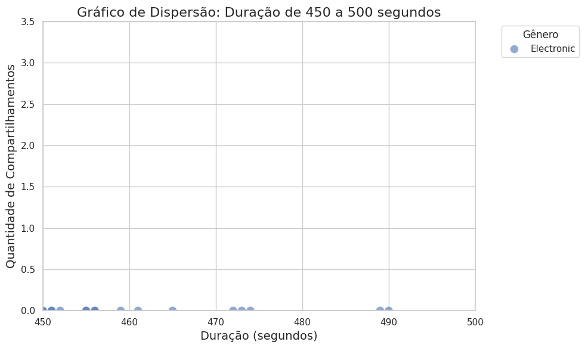

# NexusSong

## Introdução

Este projeto foi realizado com fins acadêmicos na matéria de prática e pesquisa do NES (Novo Ensino Suplementar).
Neste projeto, iremos analisar os dados encontrados em um arquivo csv que tratam dos dados de um streaming de música.

## Resultados:

### Distribuição de compartilhamentos por gênero musical.

### Boxplot da distribuição de compartilhamentos por gênero.

### Dados de distribuição de músicas por gênero - gráfico de barras

### Distribuição percentual de músicas por gênero

### Média de duração de streams por gênero

### Identificação de outliers na duração de streams.

### Popularidade mensal por gênero (duração média dos streams)

### Popularidade diária por gênero no natal

### Popularidade diária por gênero no Ano Novo

### Popularidade diária por gênero na Páscoa

### Popularidade diária por gênero no Halloween

### Popularidade diária por gênero no Carnaval

### Horários de pico de reprodução

### Frequência de gêneros para a faixa etária menores de 18 anos

### Frequência de gêneros para a faixa etária 18-24 anos

### Frequência de gêneros para a faixa etária 25-34 anos

### Frequência de gêneros para a faixa etária 35-44 anos

### Frequência de gêneros para a faixa etária 45-54 anos

### Frequência de gêneros para a faixa etária 55+ anos

### Heatmap de correlação das variáveis de música

### Gráfico de dispersão: Duração de 0 a 50 segundos

### Gráfico de dispersão: Duração de 50 a 100 segundos

### Gráfico de dispersão: Duração de 100 a 150 segundos

### Gráfico de dispersão: Duração de 150 a 200 segundos

### Gráfico de dispersão: Duração de 200 a 250 segundos

### Gráfico de dispersão: Duração de 250 a 300 segundos

### Gráfico de dispersão: Duração de 300 a 350 segundos

### Gráfico de dispersão: Duração de 350 a 400 segundos

### Gráfico de dispersão: Duração de 400 a 450 segundos

### Gráfico de dispersão: Duração de 450 a 500 segundos

### Gráfico de dispersão: Duração de 500 a 550 segundos

### Tendência de popularidade ao longo do tempo

### Plataformas mais utilizadas

### Dispositivos mais utilizados

### Qualidade de streaming mais utilizada

